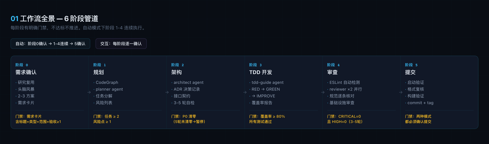
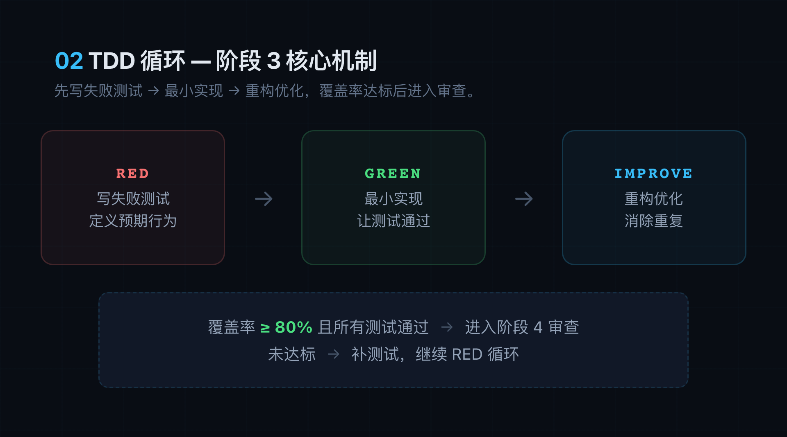
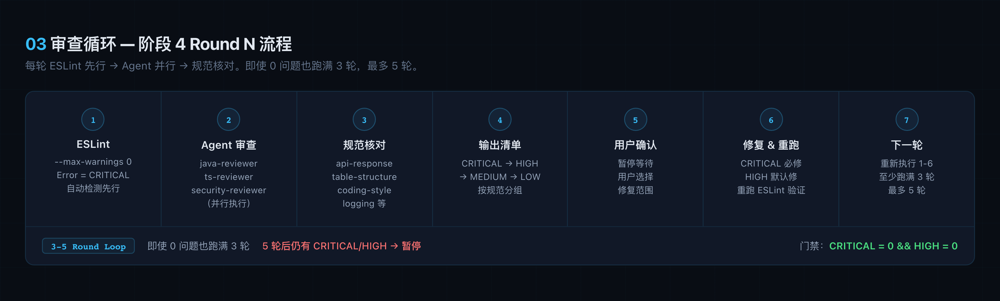
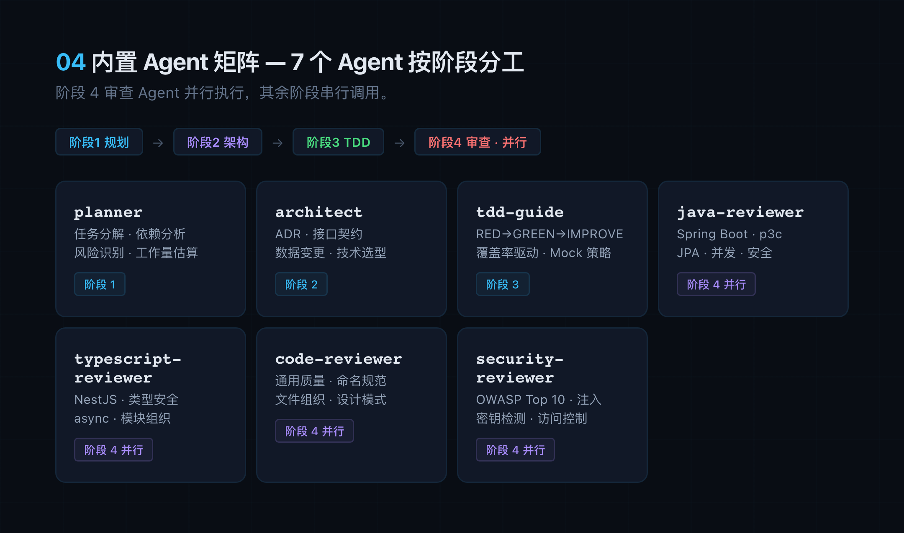

# 一把梭 (yibasuo) — 全流程开发管线 v3.0.0

> 需求 → 规划 → 架构 → 测试驱动开发 → 审查 → 提交。
> 7 个内置 Agent + 4 套 Rules，流程化消除 AI 编码的随机性。

---

| 模式 | 触发词 | 行为 |
|------|--------|------|
| 自动（默认） | `一把梭` `全流程` `梭哈` | 阶段 0 确认后连续执行，提交前确认 |
| 交互 | `一步步梭` `交互梭` `确认梭` | 每阶段确认后继续 |

中途切换：`停一下` → 交互模式 · `继续梭` → 自动模式

---

## 安装

```bash
git clone git@github.com:occultskyrong/yibasuo-skill.git /tmp/yibasuo-skill
cd /tmp/yibasuo-skill && bash install.sh        # Claude Code
cd /tmp/yibasuo-skill && bash install.sh --codex # Codex
```

**更新**：`cd /tmp/yibasuo-skill && git pull && bash install.sh --force`
**版本**：`cat ~/.claude/skills/yibasuo/.installed-version`

---

## 工作流全景



不达标不推进。阶段 0 和阶段 5 不论模式都必须确认。

---

## 各阶段详情

### 阶段 0 · 需求确认

1. 研究复用 — 搜索已有实现、开源项目、包注册表；hotfix/配置变更/文档更新可跳过
2. 澄清需求 — 一次聚焦一个主题；跨模块可一次提 2-3 个关联问题
3. 确认技术栈和影响范围
4. 提出 2-3 种方案，含 trade-off 和推荐理由
5. 输出需求卡片（标题 / 类型 / 范围 / 验收标准）

**门禁**：需求卡片必须含标题、类型、范围、验收标准（≥1 条）

### 阶段 1 · 规划

1. CodeGraph 获取项目结构摘要；检查 CLAUDE.md，有则增量更新
2. 调用 `planner` agent — 输入需求卡片 + 项目结构 + 语言规范
3. 产出：任务分解、依赖关系图、风险点列表

**门禁**：任务≥2，风险点≥1

### 阶段 2 · 架构

1. 调用 `architect` agent — 输入需求 + 计划 + 语言规范
2. 产出：ADR（决策/后果/替代方案）、接口契约、数据变更
3. 自检 P0 问题 — 至少 3 轮、最多 5 轮

**门禁**：P0 清零。5 轮后仍有 P0 → 暂停等用户决定

### 阶段 3 · 测试驱动开发



1. 调用 `tdd-guide` agent — 先读 `rules/<lang>/testing.md`
2. RED → GREEN → IMPROVE — Bug 修复时关键代码加注释说明根因
3. 展示覆盖率报告

**门禁**：覆盖率 ≥ 80% 且所有测试通过

### 阶段 4 · 审查



1. ESLint 自动检测（Error 规则 = CRITICAL）→ agent 并行审查 → 规范逐条核对 → 基础设施审查
2. 输出分级清单（CRITICAL > HIGH > MEDIUM > LOW），ESLint 错误单独标注
3. CRITICAL 必修，HIGH 默认修；修复后重跑 ESLint 验证
4. 至少 3 轮、最多 5 轮。5 轮后仍有 CRITICAL/HIGH → 暂停等用户决定

**门禁**：CRITICAL = 0 且 HIGH = 0

### 阶段 5 · 提交

1. 启动验证（确认无启动错误后停进程）
2. 环境检查 + `git diff --stat`
3. 格式复核（ESLint 阶段 4 已过）+ 构建验证
4. 完成前验证：测试通过 + 无 CRITICAL/HIGH + 格式已执行 + 构建通过 + 无调试残留 + 接口含 requestId/metadata + DDL 变更含迁移文件
5. 文档更新（CLAUDE.md + README.md）
6. 生成 Conventional Commits 消息 → 确认 → commit + SemVer tag（标签不可变）→ 询问是否 push

### 内置 Agent 矩阵



---

## 任务适配

| 任务类型 | 阶段 | 说明 |
|--------|------|------|
| 新功能 | 0 → 5 | 完整流程 |
| 重构 | 0 → 2 → 3 → 4 → 5 | 阶段 0 范围确认，阶段 2 影响分析，阶段 3 回归测试 |
| Bug 修复 | 3 → 4 → 5 | TDD → 审查 → 提交 |
| 依赖升级 | 2 → 3 → 4 → 5 | 兼容分析 → 全量回归 → breaking change 审查 |
| 数据库迁移 | 0 → 5 | 阶段 0 确认范围+大表风险，阶段 5 迁移文件不可变检查 |
| 注释 | 3 → 4 | 补充 Javadoc/JSDoc，不修改业务逻辑 |
| 单文件小改 | — | 不建议用一把梭，直接手改 + code-reviewer |
| 纯研究/调研 | — | 用 planner agent 出调研报告 |

---

## 技术栈

| 技术栈 | 测试框架 | 格式检查 |
|------|--------|--------|
| Java / Spring Boot | JUnit5 + Mockito + Testcontainers | p3c (阿里巴巴) |
| Node.js / NestJS | Vitest + supertest + Playwright | Prettier + ESLint |
| Vue / React | Vitest + Testing Library + Playwright | Prettier + ESLint |

覆盖 HTTP/BFF 和 gRPC 微服务两种架构模式。

---

## 规范规则

安装后按文件 `paths:` 匹配语言自动加载。规范路由入口 `patterns.md` 按场景路由到具体文件，各阶段渐进式暴露：

- 阶段 1 规划期：读 patterns.md 路由表 → 确定适用规范清单 → 注入 planner
- 阶段 2 架构期：按适用规范对照自检
- 阶段 4 审查期：全量规范逐条核对

### Common（通用，所有语言）

| 规范 | 覆盖内容 |
|------|---------|
| patterns | 统一返回结构 · API 版本控制 · RESTful 设计 · HTTP/gRPC 分层 · 定时任务 |
| table-structure | MySQL 表结构命名 · 字段类型(p3c) · 审计字段 · DDL 模板 · 审查清单 |
| database-migration | 迁移 6 步流程 · 幂等 · 回滚 · 大表策略 · 反模式 |
| security | OWASP Top 10 · 访问控制 · 注入防护 · 密码存储 · 安全头 · 依赖安全 |
| concurrency | 线程池 · CompletableFuture 超时 · ThreadLocal · 锁 · 并发集合 · Virtual Threads |
| elasticsearch | 索引命名 · 读写别名 · index template · ILM 策略 |
| mongodb | 集合命名 · 字段命名 · 混合文档 · 删前归档 · 索引策略 |
| testing | 覆盖率≥80% · TDD: RED→GREEN→IMPROVE · AAA 模式 · Mock 策略 |
| development-workflow | 研究复用→规划→TDD→审查→提交 |
| git-workflow | 分支命名 · Conventional Commits · SemVer Tag · 敏感文件检查 |
| coding-style | 不可变性 · 命名 · 注释规范 · 文件组织 · 错误处理 |
| code-review | 审查清单 · 严重级别 · Agent 选择 · 安全审查触发条件 |
| agents | 7 个 Agent 职责定义和调用时机 |
| performance | 模型选择策略 · Context Window 管理 |
| api-response · api-versioning · restful-api · grpc-layering · time-format · scheduled-tasks · logging · hooks | 各专题独立文件，由 patterns.md 路由 |

### Java（Spring Boot 4.0+ / Java 21）

| 规范 | 覆盖内容 |
|------|---------|
| patterns | Repository/Service/Controller 分层 · 构造器注入 · DTO 映射 · 数据库索引(p3c) · gRPC 分层 |
| security | Spring Security · AES-256 PII 加密 · JWT HS256 · Redis Token 黑名单 · DataScopeHelper · BCrypt cost=12 |
| testing | JUnit5+AssertJ+Mockito · Testcontainers(禁止 H2) · JaCoCo · AIR 原则 |
| coding-style | POJO 规范 · equals/hashCode · Virtual Threads · Javadoc 强制范围 · @Transactional/@Async 注释 |
| logging | SLF4J+Logback · AsyncAppender · traceId(MDC) · JSON 格式(prod) · 敏感数据脱敏 |

### TypeScript（NestJS 11+ / Node 24 LTS）

| 规范 | 覆盖内容 |
|------|---------|
| patterns | Controller→Service→Repository · DTO/Guard/Interceptor/ExceptionFilter · BullMQ · gRPC 分层 |
| security | Helmet/CORS/CSRF(禁止 csurf) · 速率限制 · NoSQL 注入 · JWT · bcrypt cost=12 |
| testing | Vitest+supertest+Playwright · Mock 策略 · 异步状态覆盖 |
| coding-style | `satisfies` · 泛型约束 · Branded Types · JSDoc 强制范围 · 依赖管理(禁止手动编辑 package.json) |
| logging | pino · traceId(AsyncLocalStorage) · 结构化日志 · 时间格式 yyyy-MM-dd HH:mm:ss.SSS |

### Web（Vue / React）

| 规范 | 覆盖内容 |
|------|---------|
| patterns | 组件模式 · Custom Hooks · 状态管理(Pinia/Zustand) |
| testing | Vitest+Testing Library · Playwright E2E |
| coding-style | 组件命名 · 文件组织 · CSS 方案 |
| static-website-checklist | CDN 国内替换 · ICP/公安备案 · SEO(hreflang/OG/Sitemap) · 模板残留清理 |

---

## Token 消耗

| 场景 | 直接对话 | 一把梭 | 倍数 |
|------|---------|--------|:--:|
| 新功能（中等复杂度） | ~25K | ~70K | ~2.8x |
| Bug 修复 | ~12K | ~30K | ~2.5x |
| 简单改动 | ~5K | ~7K | ~1.4x |

> 基于 v2.17 实测估算（CodeGraph + 渐进式规范路由后）。额外成本换取：架构评审 + 强制 TDD（覆盖率≥80%）+ 代码审查 + 安全审查 + 基础设施审查 + 规范对照检查。启用 CodeGraph 可减少 ~62% 工具调用和 ~25% 总 token。

---

## 生态

- [yibasuo-infra](https://github.com/occultskyrong/yibasuo-infra) — 项目骨架初始化（Spring Boot / NestJS / gRPC）
- [yibasuo-skill](https://github.com/occultskyrong/yibasuo-skill) — 全流程开发管线

---

## 协议

[MIT License](LICENSE) — 允许任何人随意使用、复制、修改、分发、出售。
